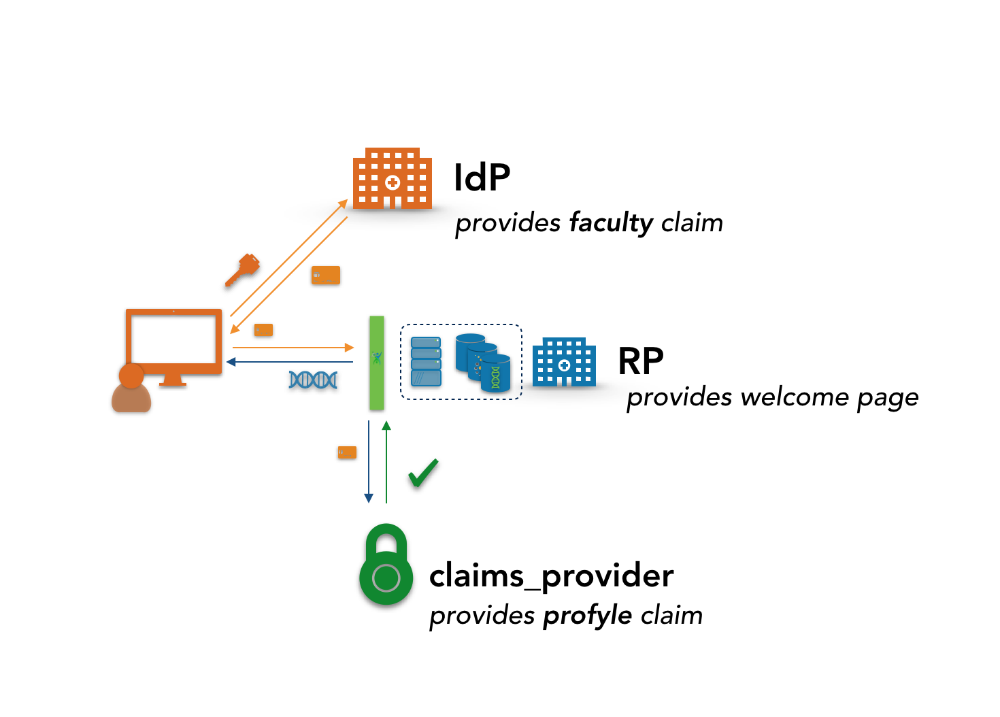

# Simple distributed claims example

A simple distributed claims example using pyoidc.  These are lightly modified versions of the simple_op/simple_rp example that comes with pyoidc.



To run:

```
virtualenv distclaims
source distclaims/bin/activate
pip3 install -r requirements.txt
```

In one terminal run the IdP

```
source distclaims/bin/activate
cd IdP
sudo python3 src/run.py settings.yaml.example -p 443
```

In one terminal run the RP (relying party - the site using the IdP and claims provider)

```
source distclaims/bin/activate
cd RP
python3 src/rp.py settings.yaml.example -p 8000
```

And in another, run the claims provider:
```
source distclaims/bin/activate
cd claims_provider
python3 foo.py
```

Then proceed to https://localhost:8000 (note - self-signed certifcates, may cause some problems) and provide the IdP hostname (localhost)

Then log in with:

user: diana pass: krall
* Faculty member
* Not project member

user: babs pass: howes
* Not faculty member
* Project member

user: upper pass: crust
* Faculty member
* Project member
